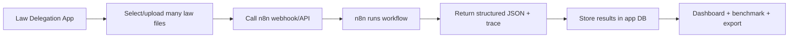

# Current Project Handoff

Last updated: 2026-06-24

This is the short context file to give a new agent before continuing work.

## Product Goal

Build a research app for law-delegation coding. The app should help researchers run repeatable, auditable coding methods over many law files, inspect intermediate reasoning, compare against benchmarks, and export clean research variables.

The immediate research workflow is:

1. decide whether a law contains meaningful administrative delegation;
2. if no delegation, set discretion rank to `0` deterministically;
3. if delegation exists, classify discretion rank using the delegation decision details and the law text.

Final dashboard variables should stay clean:

- `delegate_law`
- `discretion_rank`

Supporting fields should be available as trace/audit details, not noisy default dashboard columns.

## What Was Recently Implemented

### Standalone Coding Workflow Foundation

Implemented a reusable workflow system separate from existing campaign/dashboard behavior:

- Workflow Library;
- visual workflow builder;
- typed nodes;
- LLM analysis nodes with multiple outputs;
- condition branches;
- deterministic set-value nodes;
- validation nodes;
- dashboard output nodes;
- draft saving;
- immutable publishing/version snapshots;
- isolated workflow test execution;
- temporary uploaded text-file testing;
- execution traces with skipped/completed nodes.

This was intentionally not connected to campaign execution yet.

### DB-Managed Workflow Templates

Moved workflow starters toward an n8n-style DB-managed model:

- added DB-backed workflow templates;
- added template CRUD/import/export/duplicate APIs;
- added template cards in the Workflow Library;
- workflow creation can copy from a DB template via `template_id`;
- existing workflow drafts and published versions remain independent snapshots.

Important nuance:

- Workflow instances and published versions are DB JSON.
- Templates are DB-managed after seeding.
- The seed definitions still live in code only as initial/fallback defaults.
- Future normal template edits should happen in DB/UI/imported JSON, not by editing code.

### Law Delegation + Discretion Rank Template

The project template was refined so the Law Delegation node is still one LLM call, but now emits explicit typed fields:

- `delegate_law`
- `delegation_rationale`
- `administrative_actors`
- `delegated_authorities`
- `constraints_summary`
- `constraint_strength`
- `delegation_breadth`
- `delegation_centrality`

The Discretion Rank node consumes those fields and emits:

- `discretion_rank`
- `discretion_rationale`
- `rank_evidence`

The final output node still emits only:

- `delegate_law`
- `discretion_rank`

Existing workflow drafts are not automatically mutated. To see the latest template, create a fresh workflow draft from the updated template, or manually edit the existing draft.

### Docling Temporarily Disabled For Text-Only Use

Docling remains in the project but is not required for plain text uploads right now. Text/markdown/html uploads use lightweight extraction so the free-tier deployment does not fail from Docling memory/module issues.

Docling can be re-enabled later with a small config/code-path change when PDF/DOCX parsing is needed again.

## Current Strategic Decision

The user questioned whether to keep building an n8n-like workflow engine ourselves.

Current decision for now:

- Park n8n integration for the moment.
- Focus on a basic working prototype for this specific law-delegation use case.
- Avoid turning the native builder into a full n8n clone.
- Keep this app focused on research-specific needs:
  - document/campaign management;
  - batch execution over 50+ files;
  - storing structured results;
  - dashboard review;
  - benchmark comparison;
  - audit trace inspection;
  - CSV/export behavior.

Possible future architecture:



This may save significant time because n8n already has:

- visual workflow editing;
- branches;
- code/function nodes;
- LLM integrations;
- webhook/API triggering;
- execution logs;
- reusable JSON workflow definitions.

n8n remains a possible future architecture if the native prototype becomes too expensive to generalize.

## Latest Runtime Fix — Workflow Test 500

The workflow test modal was showing `Failed to fetch` when running pasted text or uploaded text files. Browser devtools showed the deployed backend returned a raw `500 Internal Server Error` from:

```text
POST /api/workflows/{workflow_id}/test?workspace_id=PRODUCTION
```

The pasted-text request shape was valid. The likely root cause was backend execution, especially workflow LLM calls.

Implemented fixes:

- workflow AI nodes now send a real `user` message plus a short `system` instruction;
- this avoids Gemini receiving only `system_instruction` with an empty `contents` list;
- workflow test routes catch provider/runtime failures and return JSON `502` details instead of raw 500s;
- the app has a generic JSON exception handler for remaining unhandled backend errors;
- frontend workflow API calls now show a clearer API reachability/server-error message instead of only `Failed to fetch`.

Verification:

```bash
cd backend
env DB_PROVIDER=sqlite venv/bin/python -m pytest -q app/tests/services/test_workflow_engine.py app/tests/routes/test_workflows.py
```

Result:

```text
14 passed
```

Frontend build:

```bash
cd frontend
npm run build
```

Result: passed.

## What We Should Do Next

Recommended next phase:

1. Continue native prototype for the two-variable Law Delegation + Discretion Rank use case.
2. Add campaign/batch execution for workflow results:
   - select workflow/template/provider;
   - run against many uploaded text files;
   - persist final values and trace/audit JSON;
   - show two main columns with expandable details.
3. Add a DB/template JSON editor or import workflow so research changes do not require deployment.
4. Avoid more hardcoded project-template changes unless they are only seed/fallback updates.
5. If the native workflow builder becomes too broad, revisit an `external_workflow_provider` layer:
   - provider type: `native` or `n8n`;
   - endpoint/webhook URL;
   - auth secret;
   - input mapping;
   - output schema mapping;
   - trace/result storage.

## Important Design Principles

- Research workflow definitions should be dynamic JSON/DB records.
- Code should define generic capabilities, not project-specific research decisions.
- Code changes are appropriate for:
  - new node types;
  - executor behavior;
  - validation;
  - UI infrastructure;
  - external provider integrations.
- Code changes are not ideal for:
  - prompt wording;
  - Law Delegation fields;
  - rank rubric edits;
  - branch condition edits;
  - final output selection.
- Existing campaign/dashboard behavior should not be broken while workflow adoption is experimental.
- Published workflow versions should remain immutable for research reproducibility.

## Recent Verification

Focused tests passed after the latest workflow changes:

```bash
cd backend
env DB_PROVIDER=sqlite venv/bin/python -m pytest -q app/tests/services/test_workflow_engine.py app/tests/routes/test_workflows.py
```

Result:

```text
13 passed
```

Frontend build also passed:

```bash
cd frontend
npm run build
```

## Known Caveats

- Existing drafts copied from older templates will not automatically receive the new 8-output Law Delegation node.
- The latest DB seed upgrade only updates untouched system seed templates, not user-edited templates.
- The native workflow builder is useful but can become a time sink if we keep trying to clone n8n.
- Campaign/dashboard execution is still not fully connected to workflows.
- Batch workflow testing over 50+ files is still a future step.
