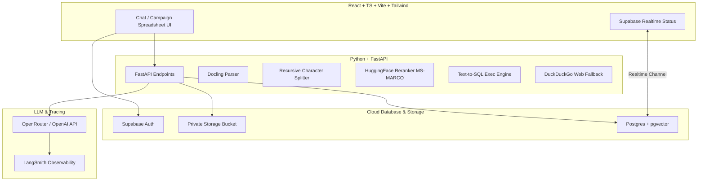

# 🎯 Project Goal: Legislative Coding Platform (Agentic RAG Masterclass)

This document is the single source of truth for the **Agentic RAG Masterclass** repository. It outlines the project's core objectives, the academic and research context, system architecture, and constraints.

---

## 🏫 Academic & Research Context (SIPA Quantitative Analysis II)

This platform is being built to support academic research in policy analysis and program evaluation under the **School of International and Public Affairs (SIPA)** for the course **Quantitative Analysis II**. 

### The Research Question
In political science and public policy, researchers study **congressional delegation** and **agency discretion**:
*   How often does Congress delegate authority to executive agencies (like the SEC, EPA, or Treasury)?
*   How much discretionary power does Congress grant them?
*   What constraints (e.g., spending limits, reporting requirements, sunsets) are placed on those agencies?

Traditionally, to answer these questions, researchers hire Research Assistants (RAs) to read thousands of pages of financial regulation laws (e.g., from the *CQ Almanac* summaries or full statutory text) and manually record variables in spreadsheets. This project automates that process using LLMs, creating a **Systematic Legal Document Coding Platform**.

The resulting dataset (e.g. discretion scores, constraint types, agency names) is exported as a CSV, allowing students and professors to run **multiple regression analysis** to evaluate the causes and effects of policy design.

---

## 🚀 The Core Application Goals

Our application provides two distinct operational paradigms:

1.  **📊 The Campaign Coding Runner (Primary Goal)**:
    *   **Single-Document Structured Extraction**: The system iterates through a collection of uploaded laws (like the `.txt` files in `finance_final_txts`).
    *   **Staged Prompt Implementation**: For each file, the system feeds the *entire document content* (not semantic chunks) into the LLM alongside a structured codebook prompt (like `Prompt_v3.txt`).
    *   **Reasoning-Based Variables**: The LLM executes a multi-stage analysis (detecting delegation, listing delegees, mapping constraints to 12 distinct categories, and applying consistency checks) before outputting a final **Discretion Score (0-4)**.
    *   **Coded Grid Interface**: Results populate a spreadsheet dashboard where researchers can inspect the LLM’s extracted values, review quotes/rationales, override values manually, and export the dataset as a CSV.

2.  **💬 The Exploratory Chatbot (RAG + SQL Assistant)**:
    *   An interactive chat interface that operates *after* the documents have been uploaded or coded.
    *   **RAG Retrieval**: If a user asks a question about the document text (e.g., *"What did the Real Estate Settlement Act of 1975 say about escrow accounts?"*), the system uses vector + keyword hybrid search to retrieve matching text chunks.
    *   **Text-to-SQL Routing**: If a user asks a quantitative question about the spreadsheet data (e.g., *"How many laws in our campaign have a discretion rank of 4?"*), the agent uses a SQL tool to query the underlying database tables and returns structured statistics.

---

## 🛠️ System Architecture

---

## 📈 Comparing the Codebook Prompt Versions

To achieve research-grade accuracy, the prompt evolved to overcome standard LLM biases:

*   **Prompt v1 (One-Shot Direct)**: Asked the LLM to output `DelegateLaw` and `RG_Discretion_Rank (0-4)` in a single step.
    *   *Flaw*: The LLM over-indexes on any mention of an executive agency or standard rulemaking authority. Because it has no step-by-step thinking about constraints, it codes almost every law as a `4` (high discretion). This creates an "all-4s" dataset with zero variance, making it useless for statistical regression analysis.
*   **Prompt v2 (Modular Direct)**: Split the delegation and discretion tasks into separate model runs (V1: delegation label, V2: delegation with rationale, V3: discretion rank, V4: discretion rank with rationale), but still relied on single-pass judgments without forcing the LLM to evaluate constraints systematically.
*   **Prompt v3 (Staged Coding - Version 6)**: Forces a **5-stage sequential reasoning pipeline**:
    1.  **Stage 1**: Screen for delegation presence (`DelegateLaw: Y/N` with textual evidence and rationale).
    2.  **Stage 2**: Measure delegation level (None/Low/Moderate/High) and centrality, and list the delegee agencies and authority.
    3.  **Stage 3**: Check for constraints (statutory limits on authority) and rate constraint levels.
    4.  **Stage 4**: Map constraints to **12 predefined categories** (e.g. reporting, consultation, spending limits, sunsets, exemptions, appeals, direct oversight).
    5.  **Stage 5**: Assign the final **Discretion Rank (0-4)** using strict consistency rules (e.g., if delegation is Low and constraints are High, the rank must be a `1` or `2`, never a `4`). This forces the LLM to lower the score when constraints are present, solving the "all-4s" bias.

---

## 🔍 Understanding Social Science "Coding" vs "Programming"

In this project, **"Coding"** refers to the social science method of **content analysis** or **document coding**. It does **not** mean writing computer software.
*   **Social Science Coding**: A researcher reads a text (e.g., a law summary) and categorizes it using variables (e.g., assigning `DelegateLaw = Y` and `RG_Discretion_Rank = 2`).
*   **The Problem**: Doing this manually with research assistants (RAs) is slow, expensive, and subject to human fatigue.
*   **The Solution**: Automating this process using structured LLM outputs to read the texts and fill the database, allowing researchers to download a CSV and run regression models.

---

## 📊 The Sample Excel Data & "Missing Language"

The professor provided a sample Excel spreadsheet mapping specific Public Laws to their manual coding results (assigned by human researchers).
*   **Top Table (Description Language Provided = Y)**: Includes 15 laws (like PL 99-571, PL 97-444, PL 94-29). The actual text ("language") of these law summaries is provided in Tab 2 of the Excel sheet. Because these are short summaries, they can fit inside Excel cells and represent a perfect test suite for the LLM.
*   **Bottom Table (Language Provided = N / "Nine Laws missing language")**: Contains 9 laws (like PL 101-508, PL 111-203, PL 94-200) where the text is **not** provided in Tab 2.
    *   *Why are they missing in Excel?* Many of these laws are massive (e.g., Dodd-Frank PL 111-203 is 3.1MB, and PL 101-508 is 1.8MB). Since Excel has a hard limit of 32,767 characters per cell, their full statutory text could not be pasted into the spreadsheet.
    *   *Source File Inconsistency*: In our `finance_final_txts` folder, the source files for some of these laws are fragmented or corrupted. For example:
        *   `1964_88-353_HR8459.txt` actually contains Title XI of the Civil Rights Act of 1964 (PL 88-352) instead of the Federal Credit Union Act Amendments.
        *   `1975_94-200_S1281.txt` is missing the first two titles and starts at Section 305.
        *   `1971_92-9_HR5432.txt` starts mid-sentence and then appends Public Law 92-10.
        *   `1966_89-356_S1698.txt` starts mid-sentence and appends Public Law 89-357.

---

## 🛠️ Tech Stack Alignment: LLM vs SQL vs RAG

To build what the professor wants, three distinct technical components are utilized:
1.  **Structured LLM Calls (The Coding Runner)**: Used to read the *entire* document text and return a structured JSON output (Pydantic model) containing the coded variables and evidence. **RAG (vector retrieval) is NOT used here** because checking for global properties like "discretion score" or "all constraints" requires reading the full context of the document, not matching snippets.
2.  **SQL Database (The Structured Store & Analytics)**: Stores the final coded dashboard results (`coded_values` JSON). If a researcher asks a quantitative question (e.g., *"What is the average discretion score of all coded laws?"*), the system routes the question to a **Text-to-SQL tool** that queries the database directly.
3.  **RAG (vector search) (The Chat Assistant)**: Used only in the exploratory chat interface. If a user asks a qualitative question about specific contents of a law (e.g., *"What did the Real Estate Settlement Act of 1975 say about escrow accounts?"*), RAG retrieves the relevant vector-matched text chunks to answer.

---

## ⚠️ Key Operational Constraints

1.  **No LLM Frameworks**: Use raw OpenAI SDK calls for completions and tool loops.
2.  **Strict Row-Level Security (RLS)**: Users must only access their own threads, campaigns, and files.
3.  **SSE Streaming**: Chat responses and tool logs must stream token-by-token.
4.  **Supabase Realtime**: Use database triggers and channels to report background ingestion status in the UI.
5.  **LangSmith Observability**: Trace all LLM calls with campaign, user, and document metadata tags.

